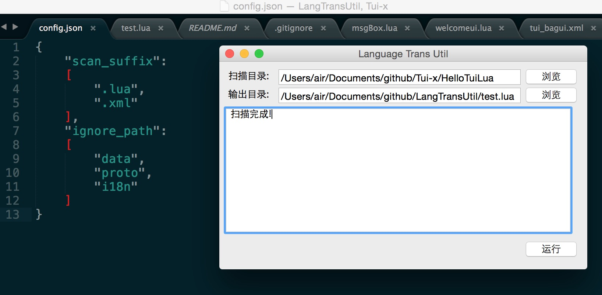
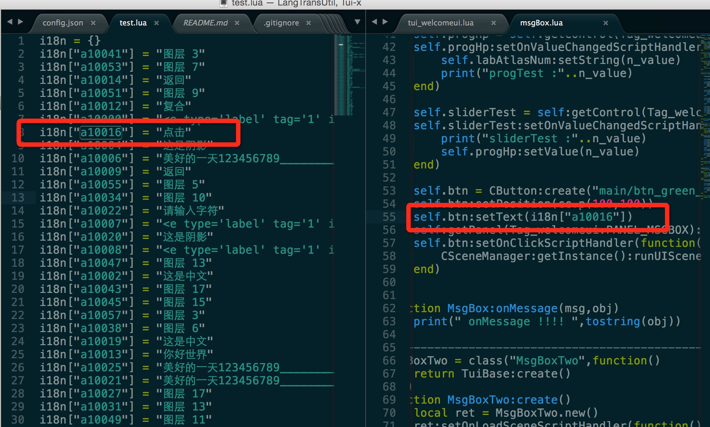
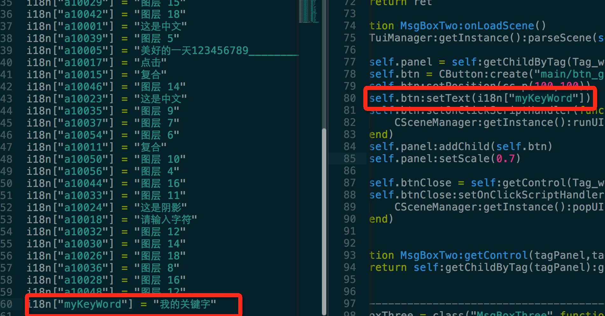

Language extraction tool
=====

可配置扫描的文件类型，和过滤扫描的目录

自动替换文件中的中文字符串

可以人工手动添加自己的关键字内容，不受扫描程序影响

This is a Chinese string scanning tool, to help you filter out all the code in the Chinese character string

简介：

这是一个中文字符串扫描工具，帮你筛选出代码中的所有中文字符串

特性:

0.可配置扫描的文件类型，和过滤扫描的目录。
1.可以人工手动添加自己的关键字内容，不受扫描程序影响。
2.通用，可以扫描任何用双引号表示的字符串语种。